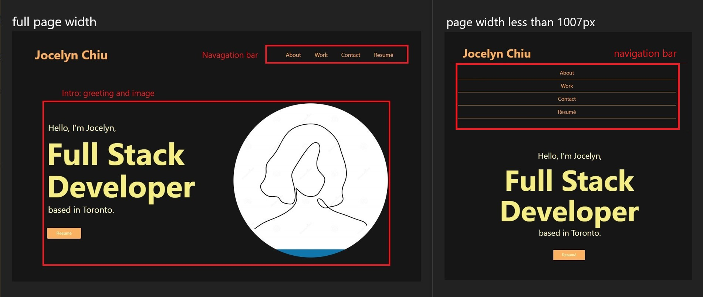
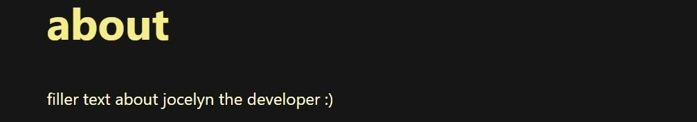
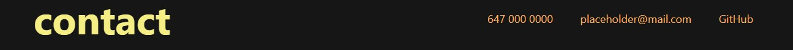

# jocelyn-coding-portfolio

## Description

Jocelyn's coding portfolio showcases the skills and talents she offers to potential employers. It contains an "about" section, where you can get to know her, as well as a collection of her top works to date. This portfolio also allows a means to contact her and view all the public repositories she has worked on.

## Deployed Application

## Usage

Through a clean and intuitive interface, users can quickly navagate the page using the clickable links in the navagation bar (located at the top right when the page is fully expanded, and top center when the page width is less than 1007px).

Along with the header, users are greeted with a "Hello..." text introducing Jocelyn as a Full Stack Developer, as well as a large profile icon on the right. Right below the introduction text, is a placeholder button that will bring users to her resumé once it is completed.

Upon scrolling down, users will be met with an about section detailing more about Jocelyn's skills and history in the field.

The next section, titled "work", showcases fully deployed web applications Jocelyn has been a part of, and is proud to share. When users hover over these images, the image opacity decreases to 50% and the border glows orange. This intuitively lets the user know these are clickable links.

At the bottom of the page, there is a section titled "contact" where the user can call, email or visit Jocelyn's GitHub.

At the very bottom, Jocelyn has included a footer with the last updated date. As this is more of a personal touch and is not relavent to employers, it has intentionally been made hard to read.

## Credits

Wireframe template by Rishabh Singh on Figma: https://www.figma.com/community/file/1079379594135318786

## License
Please refer to the LICENSE in the repo.